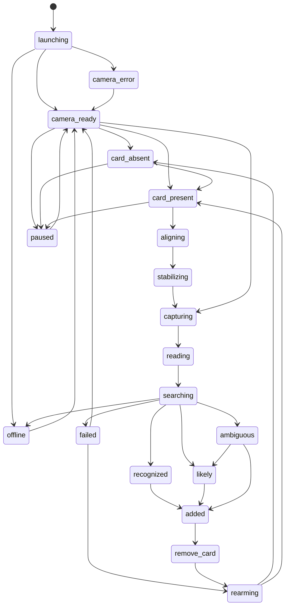

# Scanner 2.0 Interaction Specification

Status: Implemented as the sprint contract for the mobile Scanner 2.0 route.

Scanner 2.0 is a camera-first Trading Docks vision terminal for high-speed TCG intake. The interaction model preserves the existing Apple Vision OCR, Magic title recognition, Scryfall candidate lookup, top-three candidates, scanner session insertion, offer math, temporary-image cleanup, manual fallback, diagnostics, and user-scoped persistence systems.

## Batch-First Update

Implemented: The active scanner now follows "Scan first. Review the list later." Supported matches are inserted into Scanner Session Review immediately, then the scanner asks for card removal before rearming.

Implemented: The active scanner no longer shows per-card Add, pricing, quantity, condition, finish, confidence badge, "Why this match?", or result-card metadata. Those decisions live in Scanner Session Review.

Implemented: Manual search selection adds the selected printing to the Review List and returns to the camera.

Implemented: Failed recognition does not add an unknown row. It shows compact Retake/Search recovery.

## Product Principle

The scanner should feel closer to a professional card-show buying terminal than a settings screen. The camera is the primary surface, the instruction is the primary text, the latest-scan confirmation is tiny, and the Review List chip stays pinned and glanceable. While the active Scan route is open, normal bottom navigation is hidden and restored when the user leaves the route.

Primary hierarchy:

1. Compact header
2. Camera
3. Active instruction
4. Torch, Capture, Search controls
5. Tiny transient latest-scan confirmation
6. Compact Review List chip

## State Model

| State | Primary Message | Guide Appearance | Controls | Result Behavior | Haptics | Accessibility Announcement | In | Out | Timeout / Recovery |
| --- | --- | --- | --- | --- | --- | --- | --- | --- | --- |
| launching | Loading scanner | No guide | None | No result | None | Loading scanner | Route mount | camera_ready, offline, camera_error | Show loading state until context resolves or error appears |
| camera_ready | Camera ready | Dim slate brackets | Torch, Capture, Search | Existing result remains until next capture or clear | None | Camera ready | Permission granted and camera active | card_absent, card_present, paused, capturing | Manual search remains available |
| card_absent | Place the card inside the guide | Dim slate brackets | Torch, Capture, Search | No new result | None | Place card in guide | Camera ready without stable card signal | card_present, paused | Keep camera active |
| card_present | Center card | Cyan brackets | Torch, Capture, Search | No new result | Light selection in future native implementation | Card detected | Vision frame sees card-like boundary | aligning, stabilizing, capturing | Fall back to card_absent if card leaves frame |
| aligning | Center card | Cyan brackets with directional cue | Torch, Capture, Search | No new result | None | Center card | Card present but off-center, rotated, too close, too far, or edge-hidden | stabilizing, card_absent, paused | Continue guidance |
| stabilizing | Hold steady | Cyan to emerald brackets with restrained progress | Torch, Capture, Search | No new result | None | Hold steady | Card is aligned but stability timer is not complete | capturing, aligning, card_absent, paused | Reset timer if motion/blur changes |
| capturing | Reading card | White capture flash once | Capture disabled; Torch and Search remain secondary | Result remains unchanged until OCR completes | Selection haptic in future native implementation | Capturing card | Manual capture or auto-capture gate | reading, failed | Prevent double capture until completion |
| reading | Reading card | Blue processing brackets | Capture disabled; Search remains available | No result update yet | None | Reading card | Temporary image captured, Apple Vision OCR running | searching, failed | Cleanup temporary image on completion |
| searching | Finding match | Blue processing brackets | Capture disabled; Search remains available | No result update yet | None | Finding match | OCR title available and catalog lookup begins | recognized, likely, ambiguous, failed | Network/service errors become failed with safe copy |
| recognized | Match found | Emerald success pulse once | Controls hidden briefly | Auto-add as Suggested with tiny confirmation | Success haptic in future native implementation | Added to Review List | Candidate passes recognized threshold | added, remove_card, rearming | Do not silently finalize |
| likely | Review printing | Amber guide | Controls hidden briefly | Auto-add as Needs review with tiny confirmation | Light notification in future native implementation | Added for review | Candidate exists but confidence requires review | added, remove_card, rearming | Review details later |
| ambiguous | Needs review | Amber guide | Controls hidden briefly | Add top candidate and recognition alternatives to Review List | Warning haptic in future native implementation | Added for review | Top-three candidates exist but need review | added, remove_card, failed, rearming | Do not block camera with full-screen confirmation |
| failed | Couldn't read the card | Amber/red brackets without pulsing | Retake, Search | Small failure banner only | Warning haptic in future native implementation | Could not read card | No title, no match, network/service issue, invalid response | rearming, camera_ready, manual search | No unknown session row; details go to diagnostics only |
| added | Added | Emerald bracket pulse once | Controls hidden briefly | Compact transient overlay | Success haptic in future native implementation | Added to session | Session insertion succeeds | remove_card, rearming | Undo window remains in session review tools |
| remove_card | Remove card | Emerald brackets, removal instruction | Controls hidden; pause/settings remain in header | Compact transient overlay | None | Remove card to scan next | Duplicate prevention awaits card removal | rearming | Do not scan same stationary card twice |
| rearming | Ready for next card | Dim slate brackets | Torch, Capture, Search | Latest notice may collapse | None | Ready for next card | Card leaves frame or user retakes | card_absent, card_present, capturing | Reset per-capture race token |
| paused | Scanner paused | Slate paused guide | Settings Resume, Search | Existing Review List remains | None | Scanner paused | User pauses camera or app lifecycle pauses preview | camera_ready, offline | Resume should not replay stale capture |
| offline | Offline | Slate/amber guide | Manual search from cache, retry, pause | Cached result only if user-scoped and fresh | None | Offline | Network state unavailable during lookup | camera_ready, searching, failed | User-visible network recovery |
| camera_error | Camera unavailable | No camera guide | Retry permission, manual search | No scanner result | Warning haptic in future native implementation | Camera unavailable | Permission denied, unavailable camera, native camera error | camera_ready, manual search | Manual search remains usable |

## Transition Diagram

## Reliability Rules

- Camera opens automatically after context load and permission availability.
- Camera lifecycle is derived from `permission_pending`, `unavailable`, `starting`, `ready`, `user_paused`, `processing_paused`, `backgrounded`, and `error`.
- Resume appears only through the compact header after explicit `user_paused`.
- Failed recognition never sets `user_paused`.
- Manual search is always available when camera or network is unavailable.
- A scan has one active processing token; stale lookup completion must not overwrite a newer retake.
- Capture is disabled while capture, OCR, or lookup is active.
- Torch, Capture, and Search hide while capture, OCR, lookup, saving, added/remove-card lockout, or secondary sheets are active.
- Failed scans never create unknown session rows.
- Failure details are diagnostic-only; normal UI uses safe recovery copy.
- Title-only OCR may produce candidates, but exact-printing confidence stays capped.
- Same stationary card must not be captured again until removal/rearm.
- Pause and settings stay in the compact header; diagnostics stays development-only inside settings.

## Accessibility Rules

- Icon controls must have accessibility labels.
- State changes require visible text in addition to color.
- Result actions must remain reachable at 320 px width and large text scale.
- Candidate selection exposes selected state and exact printing metadata.
- Reduced-motion mode suppresses pulse/flash embellishments while preserving text state.
