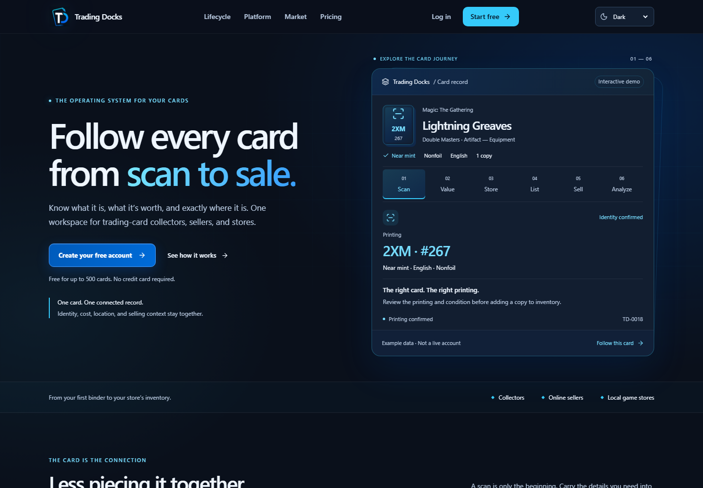
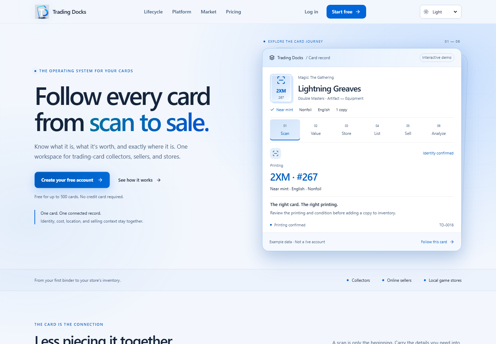
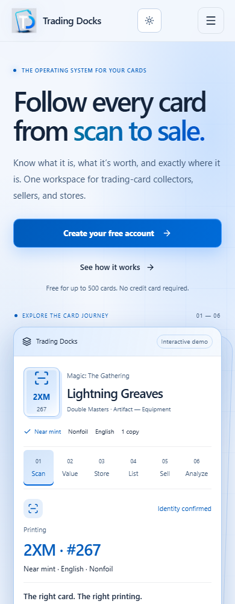

# Website polish release — September 9, 2026

Status: Implemented; prepared for main through a focused pull request.

The release was assembled in an isolated worktree from main at 87c43aa798c54709281b7ae4bd3ea10c75f30a32. Concurrent converter and employee work is preserved. No API, database, environment, deployment, dependency, or mobile changes are included.

## User experience

The homepage uses a stronger hero, a connected card lifecycle, grouped feature layouts, clearer pricing, and a more deliberate closing call to action. Electric blue and cyan from the logo carry through the site. Light, dark, and system appearance persist across navigation, reloads, and tabs. Shared controls, focus states, panels, and responsive spacing use semantic theme tokens.

Dark background: #0a101b; dark accent: #35cafa. Light background: #f3f7fd; light accent: #0065d9. Canvas exports and printed labels retain their fixed output palettes.

## Validation

- TypeScript: passed.
- ESLint on release source (excluding untracked local audit scripts): zero errors, 491 warnings.
- Next.js production build: passed during browser test setup.
- Browser suite: 150 passed, 34 skipped. Includes desktop and mobile, Chromium, Firefox, WebKit, theme persistence, navigation, and visual snapshots. Credential-dependent authenticated checks remain skipped; protected screens were not fully exercised with production accounts.
- Unit tests: 653 passed, two failed. Both failures already occur on untouched main: API access registry coverage does not classify /api/workspace/employees/invite. Baseline main had 649 passing and three failing tests; its additional stale typography assertion was aligned with the existing layout in this release.
- Expo Web / Expo Native: not run; the active Expo app is unchanged.
- Dependency installation reports six existing vulnerabilities; no dependency versions changed. The aggregate quality gate is not green because of the baseline registry failures.

## Review images





Earlier design reports describe their respective iterations and may reference local audit files. This release report and the checked-in images provide the final release evidence.

## Changed files

The manifest below covers the implementation, test, and design evidence files prepared for this release; this report is an additional new file. Existing UI changes include 180 presentation-only TSX files and 11 intentional structural changes. Shared token styles cover public pages and dashboard surfaces without changing backend behavior.

```text
A	docs/HOMEPAGE_BRAND_REFINEMENT_2026-09-09.md
A	docs/HOMEPAGE_GRAPHIC_DESIGN_REVIEW_2026-09-09.md
A	docs/HOMEPAGE_LIFECYCLE_REDESIGN_2026-09-08.md
A	docs/WEB_THEME_POLISH_2026-09-08.md
A	docs/screenshots/web-polish/home-dark-desktop.png
A	docs/screenshots/web-polish/home-light-desktop.png
A	docs/screenshots/web-polish/home-light-mobile.png
M	playwright.config.ts
M	src/app/collectors/[username]/[binderSlug]/page.tsx
M	src/app/collectors/[username]/page.tsx
M	src/app/dashboard/billing/success/page.tsx
M	src/app/dashboard/collection-buying/[id]/page.tsx
M	src/app/dashboard/home/DashboardHeader.tsx
M	src/app/dashboard/home/MetricCard.tsx
M	src/app/dashboard/inventory/inbox/page.tsx
M	src/app/dashboard/plans/PlanComparison.tsx
M	src/app/dashboard/plans/TieredPlanComparison.tsx
M	src/app/dashboard/purchase-history/page.tsx
M	src/app/forgot-password/page.tsx
M	src/app/globals.css
M	src/app/layout.tsx
M	src/app/onboarding/page.tsx
M	src/app/page.tsx
M	src/app/q/[token]/page.tsx
M	src/app/share/binder/[token]/page.tsx
M	src/app/share/portfolio/[token]/page.tsx
M	src/app/sign-in/page.tsx
M	src/app/sign-up/page.tsx
A	src/app/theme.css
M	src/app/update-password/page.tsx
M	src/components/auth/PasswordField.tsx
M	src/components/auth/RememberedEmailField.tsx
M	src/components/auth/SignInEntrance.tsx
M	src/components/auth/SignUpSubmitButton.tsx
M	src/components/billing/RevenueCatBillingManagementButton.tsx
M	src/components/billing/RevenueCatWebPurchaseButton.tsx
M	src/components/brand/trading-docks-logo.tsx
M	src/components/dashboard-v2/business/CalendarWorkspace.tsx
M	src/components/dashboard-v2/business/EmployeesWorkspace.tsx
M	src/components/dashboard-v2/business/PayrollWorkspace.tsx
M	src/components/dashboard-v2/business/ReportsWorkspace.tsx
M	src/components/dashboard-v2/business/SuppliesWorkspace.tsx
M	src/components/dashboard-v2/business/TasksWorkspace.tsx
M	src/components/dashboard-v2/business/TournamentsWorkspace.tsx
M	src/components/dashboard-v2/business/VendorsWorkspace.tsx
M	src/components/dashboard-v2/collection-buying/CardPreviewPortal.tsx
M	src/components/dashboard-v2/collection-buying/CollectionBuyingCenter.tsx
M	src/components/dashboard-v2/collection-buying/CsvImportModal.tsx
M	src/components/dashboard-v2/collection-buying/PrintingPickerModal.tsx
M	src/components/dashboard-v2/common/MetricCard.tsx
M	src/components/dashboard-v2/common/PageHeader.tsx
M	src/components/dashboard-v2/deck-vault/DeckDetailWorkspace.tsx
M	src/components/dashboard-v2/deck-vault/DeckImportCenter.tsx
M	src/components/dashboard-v2/deck-vault/DeckShowcaseStudio.tsx
M	src/components/dashboard-v2/deck-vault/DeckVaultHome.tsx
M	src/components/dashboard-v2/deck-vault/ImportedDeckLoader.tsx
M	src/components/dashboard-v2/deck-vault/ManaPips.tsx
M	src/components/dashboard-v2/inventory/BulkPurchasesWorkspace.tsx
M	src/components/dashboard-v2/inventory/InventoryWorkspace.tsx
M	src/components/dashboard-v2/inventory/PrintingSelector.tsx
M	src/components/dashboard-v2/inventory/TieredInventoryWorkspace.tsx
M	src/components/dashboard-v2/market-intelligence/MarketIntelligenceWorkspace.tsx
M	src/components/dashboard-v2/purchasing/PurchasingOverview.tsx
M	src/components/dashboard-v2/purchasing/SealedBuyingWorkspace.tsx
M	src/components/dashboard-v2/purchasing/SimplePurchasingPage.tsx
M	src/components/dashboard-v2/shell/DashboardShell.tsx
M	src/components/dashboard-v2/shell/Sidebar.tsx
M	src/components/dashboard-v2/shell/Topbar.tsx
M	src/components/dashboard-v2/styles.module.css
M	src/components/dashboard-v2/workspace/ModularWorkspace.tsx
M	src/components/dashboard/Sidebar/Sidebar.tsx
M	src/components/dashboard/Sidebar/SidebarItem.tsx
M	src/components/dashboard/Sidebar/SidebarLogo.tsx
M	src/components/dashboard/access/PlanAccessGate.tsx
M	src/components/dashboard/account/LegacyAccountDataCleanup.tsx
M	src/components/dashboard/admin/AdminControlCenter.tsx
M	src/components/dashboard/admin/AdminControlCenterWithPreview.tsx
M	src/components/dashboard/admin/AdminFeedbackQueue.tsx
M	src/components/dashboard/admin/AdminOperationsPanels.tsx
M	src/components/dashboard/admin/PlanPreview.tsx
M	src/components/dashboard/admin/TrialsManager.tsx
M	src/components/dashboard/admin/catalog/TcgplayerCatalogManager.tsx
M	src/components/dashboard/analytics/AnalyticsCommandCenter.tsx
M	src/components/dashboard/business-command-center/BusinessCommandCenter.module.css
M	src/components/dashboard/business-command-center/BusinessCommandCenter.tsx
M	src/components/dashboard/business/CalendarWorkspace.tsx
M	src/components/dashboard/business/CustomerCrmWorkspace.tsx
M	src/components/dashboard/business/EmployeesWorkspace.tsx
M	src/components/dashboard/business/PayrollWorkspace.tsx
M	src/components/dashboard/business/ReportsWorkspace.tsx
M	src/components/dashboard/business/SuppliesWorkspace.tsx
M	src/components/dashboard/business/TasksWorkspace.tsx
M	src/components/dashboard/business/TournamentsWorkspace.tsx
M	src/components/dashboard/business/VendorsWorkspace.tsx
M	src/components/dashboard/buylist/BuylistConnections.tsx
M	src/components/dashboard/buylist/BuylistWorkspace.tsx
M	src/components/dashboard/card-shows/CardShowsWorkspace.tsx
M	src/components/dashboard/card-workspace/CardWorkspaceView.tsx
M	src/components/dashboard/collection-buying/CardPreviewPortal.tsx
M	src/components/dashboard/collection-buying/CollectionBuyingCenter.tsx
M	src/components/dashboard/collection-buying/CsvImportModal.tsx
M	src/components/dashboard/collection-buying/PrintingPickerModal.tsx
M	src/components/dashboard/collection-intake/CollectionIntakeWorkspace.tsx
M	src/components/dashboard/collector-portfolio/CollectorBinderExperience.tsx
M	src/components/dashboard/collector-portfolio/CollectorPortfolioWorkspace.tsx
M	src/components/dashboard/collector-workspace/CollectorCardDetail.tsx
M	src/components/dashboard/collector-workspace/CollectorWorkspace.tsx
M	src/components/dashboard/collector-workspace/InventoryImportWorkspace.tsx
M	src/components/dashboard/collector-workspace/StorageLocationManager.tsx
M	src/components/dashboard/collector-workspace/TradeBinderWishlistWorkspace.tsx
M	src/components/dashboard/common/MetricCard.tsx
M	src/components/dashboard/deck-architect/DeckArchitectWorkspace.tsx
M	src/components/dashboard/deck-vault/DeckDetailWorkspace.tsx
M	src/components/dashboard/deck-vault/DeckImportCenter.tsx
M	src/components/dashboard/deck-vault/DeckVaultHome.tsx
M	src/components/dashboard/deck-vault/DeckmasterPanel.tsx
M	src/components/dashboard/deck-vault/ImportedDeckLoader.tsx
M	src/components/dashboard/deck-vault/ManaPips.tsx
M	src/components/dashboard/deck-vault/TieredDeckVaultHome.tsx
M	src/components/dashboard/feedback/FeedbackCenter.tsx
M	src/components/dashboard/home/ActivityFeed.tsx
M	src/components/dashboard/home/DashboardHeader.tsx
M	src/components/dashboard/home/DashboardHome.tsx
M	src/components/dashboard/home/MarketPulse.tsx
M	src/components/dashboard/home/MetricCard.tsx
M	src/components/dashboard/home/MetricGrid.tsx
M	src/components/dashboard/home/PortfolioHero.tsx
M	src/components/dashboard/home/QuickActions.tsx
M	src/components/dashboard/inventory/ChaosSortBatchDetail.tsx
M	src/components/dashboard/inventory/ChaosSortWorkspace.tsx
M	src/components/dashboard/inventory/InventoryWorkspace.tsx
M	src/components/dashboard/inventory/PrintingSelector.tsx
M	src/components/dashboard/label-studio/LabelStudioWorkspace.tsx
M	src/components/dashboard/layout/Sidebar.tsx
M	src/components/dashboard/layout/SidebarGroup.tsx
M	src/components/dashboard/layout/WorkspaceSwitcher.tsx
M	src/components/dashboard/market-intelligence/MarketIntelligenceWorkspace.tsx
M	src/components/dashboard/marketing/MarketingCampaignWorkspace.tsx
M	src/components/dashboard/marketplaces/EbayReconciliationCenter.tsx
M	src/components/dashboard/marketplaces/MarketplaceWorkspace.tsx
M	src/components/dashboard/mission-control/SellerMissionControl.tsx
M	src/components/dashboard/multi-tcg/GameContextControl.tsx
M	src/components/dashboard/notifications/NotificationBell.tsx
M	src/components/dashboard/orders/OrderPickWorkspace.tsx
M	src/components/dashboard/orders/UniversalOrdersCenter.tsx
M	src/components/dashboard/panels/MarketplaceHealth.tsx
M	src/components/dashboard/panels/Panel.tsx
M	src/components/dashboard/panels/PanelHeader.tsx
M	src/components/dashboard/panels/RevenueOverview.tsx
M	src/components/dashboard/precon-intelligence/PreconIntelligenceWorkspace.tsx
M	src/components/dashboard/purchasing/BulkBuyingCalculator.tsx
M	src/components/dashboard/purchasing/CardPhotoScanner.tsx
M	src/components/dashboard/purchasing/PurchasingOverview.tsx
M	src/components/dashboard/purchasing/SealedBuyingWorkspace.tsx
M	src/components/dashboard/purchasing/SimplePurchasingPage.tsx
M	src/components/dashboard/quick-create/QuickCreate.tsx
M	src/components/dashboard/quick-create/QuickCreateMenu.tsx
M	src/components/dashboard/search/GlobalSearch.tsx
M	src/components/dashboard/search/SearchBar.tsx
M	src/components/dashboard/seller-launch/SellerLaunchCenter.tsx
M	src/components/dashboard/settings/SettingsCenter.tsx
M	src/components/dashboard/shared/PageScaffold.tsx
M	src/components/dashboard/shell/DashboardShell.tsx
M	src/components/dashboard/shell/MobileBottomNav.tsx
M	src/components/dashboard/shell/Sidebar.tsx
M	src/components/dashboard/shell/Sidebar/Sidebar.tsx
M	src/components/dashboard/shell/Sidebar/SidebarItem.tsx
M	src/components/dashboard/shell/Sidebar/SidebarLogo.tsx
M	src/components/dashboard/shell/TieredDashboardShell.tsx
M	src/components/dashboard/shell/TieredSidebar.tsx
M	src/components/dashboard/shell/Topbar.tsx
M	src/components/dashboard/shell/Topbar/Topbar.tsx
M	src/components/dashboard/styles.module.css
M	src/components/dashboard/system/AmbientGlow.tsx
M	src/components/dashboard/ticker/CardPriceTicker.tsx
M	src/components/dashboard/tools/CsvConversionEngine.tsx
M	src/components/dashboard/workspace/CustomizeDrawer.tsx
M	src/components/dashboard/workspace/ModularDashboard.tsx
M	src/components/dashboard/workspace/ModularWorkspace.tsx
M	src/components/dashboard/workspace/WidgetCard.tsx
M	src/components/deck-vault/DeckPlaytest.tsx
M	src/components/design-system/td-primitives.tsx
M	src/components/landing/AutomationSection.tsx
M	src/components/landing/BackgroundEffects.tsx
M	src/components/landing/BrandMark.tsx
A	src/components/landing/CardJourney.tsx
M	src/components/landing/DashboardPreview.tsx
M	src/components/landing/EcosystemSection.tsx
M	src/components/landing/ExperienceSection.tsx
M	src/components/landing/FeaturesSection.tsx
M	src/components/landing/FinalCTA.tsx
M	src/components/landing/Footer.tsx
M	src/components/landing/Header.tsx
M	src/components/landing/Hero.tsx
A	src/components/landing/Homepage.module.css
M	src/components/landing/LandingHero.module.css
M	src/components/landing/LandingMotion.module.css
M	src/components/landing/LandingReflection.module.css
M	src/components/landing/LandingShimmer.module.css
A	src/components/landing/LifecycleStory.tsx
M	src/components/landing/LivingHero.module.css
M	src/components/landing/MarketSection.tsx
M	src/components/landing/PlanJourneySection.tsx
M	src/components/landing/PricingSection.tsx
M	src/components/landing/SignatureHero.module.css
M	src/components/landing/TestimonialsSection.tsx
M	src/components/landing/TrustSection.tsx
M	src/components/landing/TrustedGames.tsx
M	src/components/landing/WorkflowExperienceSection.tsx
M	src/components/legal/LegalPage.tsx
M	src/components/marketing/LiveMarketIntelligence.tsx
A	src/components/theme/ThemeProvider.tsx
M	src/components/ui/button.tsx
M	src/components/ui/card.tsx
A	src/hooks/use-hydrated.ts
M	tests/deck-vault-premium-polish.test.ts
M	tests/e2e/dashboard-auth.spec.ts
M	tests/e2e/helpers.ts
A	tests/e2e/home-pricing.spec.ts
A	tests/e2e/homepage-lifecycle.spec.ts
M	tests/e2e/public-smoke.spec.ts
A	tests/e2e/theme.spec.ts
M	tests/e2e/visual-regression.spec.ts
M	tests/e2e/visual-regression.spec.ts-snapshots/homepage-desktop-desktop-chromium-1440-win32.png
M	tests/e2e/visual-regression.spec.ts-snapshots/homepage-mobile-mobile-webkit-390-win32.png
A	tests/fixtures/theme-workspace.tsx
A	tests/helpers/local-https-server.mjs
A	tests/helpers/staging-guard.ts
M	tests/inventory-add-flow.test.ts
M	tests/membership-entitlements.test.ts
M	tests/public-web-ui.test.ts
A	tests/theme-tokens.test.ts
```
